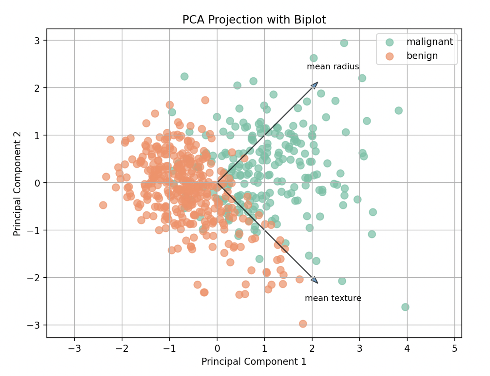

# 💡 DataQuest  
*An Unsupervised Machine Learning Explorer*

## Table of Contents
- [Project Overview](#project-overview)
- [Getting Started](#getting-started)
- [Datasets](#datasets)
- [Model Training](#model-training)
- [Evaluation Metrics](#evaluation-metrics)
- [Visualization](#visualization)
- [References](#references)

---

## Project Overview  
**DataQuest** is an interactive **Streamlit** app that allows users to explore unsupervised machine learning techniques like clustering and dimensionality reduction.

### What is unsupervised machine learning?  
Unsupervised learning refers to techniques that discover patterns in data without using labeled outcomes. As described in *Grokking Machine Learning* by **Luis G. Serrano**, these methods help reveal structure, groupings, and key relationships in datasets. Examples include:
- Dimensionality Reduction – Simplifying high-dimensional data while preserving key variance (e.g., PCA)
- Clustering – Grouping data points based on similarity (e.g., K-Means, Agglomerative)

Whether you're analyzing hidden structures in your data or exploring high-dimensional datasets, DataQuest offers hands-on tools to apply methods like Principal Component Analysis (PCA), and K-Means and Hierarchical Clustering.

---

## Getting Started

### Deployed App
Access the live version here: [**Deployed App on Streamlit Cloud**](https://dataquest.streamlit.app/)

### Run the App Locally

#### Clone & Navigate to the Repository
```bash
git clone https://github.com/annamccartan3/McCartan-Data-Science-Portfolio.git
cd McCartan-Data-Science-Portfolio
```

#### Install Dependencies  
All dependencies can be found in the requirements.txt file. Create and activate a virtual environment, then install the necessary libraries:
```bash
pip install -r requirements.txt
```

#### Run the Streamlit App
```bash
streamlit run main.py
```

Once you’re in the app, follow these steps to begin your machine learning workflow:
1. Upload your dataset or choose a demo dataset.
2. Select features to explore and reduce dimensions or cluster patterns.
3. Train a model, adjust hyperparameters, and evaluate performance.
4. Explore visualizations to understand how your model is performing.

---

## Datasets  
*Choose from two built-in demo datasets or upload your own `.csv` file.*<br>
#### Demo Datasets:
- **[Breast Cancer](https://archive.ics.uci.edu/dataset/17/breast+cancer+wisconsin+diagnostic)** – Predict tumor malignancy from medical imaging features.
- **[Countries](https://www.kaggle.com/datasets/rohan0301/unsupervised-learning-on-country-data)** – Explore demographic differences in health and economic indicators across the globe.

#### DataQuest includes built-in tools for:
- **Automatic Data Cleaning**: Detects and encodes categorical columns, or drops non-numeric/identifier columns that could interfere with model training.
- **Handling missing values**: If missing data is found, choose to drop affected rows or impute missing values with the mean.
- **Running Reproducible Tests**: Set a random state for reproducibility in model evaluation and visualization over time.

---

## Model Training  
Once features and target variables are selected, choose from the following machine learning models:
- **Principal Component Analysis (PCA)** – A dimensionality reduction technique that transforms features into a set of uncorrelated components for easier visualization and analysis.
- **K-Means Clustering** –  An unsupervised learning algorithm that partitions data into k clusters based on feature similarity.
- **Hierarchical Clustering** –  An unsupervised algorithm that builds a hierarchy of clusters using pairwise distances between data points.

Additional options include:
- Modifying the chosen target and feature variables
- Tuning hyperparameters (e.g., number of components, number of clusters, linkage type)

---

## Evaluation Metrics  
To assess your model, DataQuest provides key metrics:
- **Principal Component Analysis (PCA)**
  - *Cumulative Explained Variance:* Measures how much of the dataset’s total variance is captured by the selected principal components. Used to assess dimensionality reduction effectiveness.
- **K-Means Clustering: Explained Variance**
  - *Within-Cluster Sum of Squares (WCSS):* Indicates compactness; lower WCSS means points are closer to their cluster centroids.
  - *Silhouette Score:* Ranges from -1 to 1; higher values mean better-defined clusters (points are closer to their own cluster than others).
- **Hierarchical Clustering: Explained Variance**
  - *Silhouette Score:* Ranges from -1 to 1; higher values mean better-defined clusters (points are closer to their own cluster than others).

These metrics are displayed after training to help you compare model effectiveness.

---

## Visualization  
Visual tools help bring your model results to life:
- **Explained Variance Plots** – Show how much information is retained with each principal component.


- **K-Means Cluster Optimization** – Visualize WCSS and silhouette scores for different cluster numbers.


- **Dendrogram** – Display the hierarchical merging of clusters.


- **PCA Projections** – 2D and biplot visualizations of reduced data.



---

## References  

### Machine Learning  
- *Grokking Machine Learning* by Luis G. Serrano  

### Demo Datasets  
- [Breast Cancer Dataset](https://archive.ics.uci.edu/dataset/17/breast+cancer+wisconsin+diagnostic) – via Scikit-learn
- [Countries Dataset](https://www.kaggle.com/datasets/rohan0301/unsupervised-learning-on-country-data) – via Kaggle
