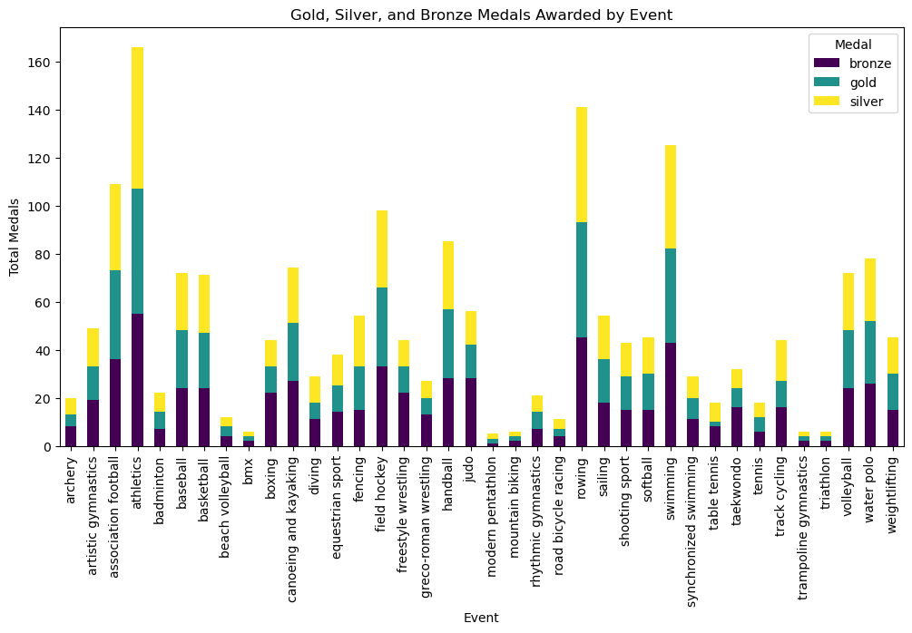

# :medal_sports: Gold Standard  
*A Data Tidying and Visualization Project*  

## Table of Contents  
- [Project Overview](#project-overview)   
- [Getting Started](#getting-started)  
- [Dataset](#dataset)  
- [Features](#features)  
- [Visualization](#visualization)  
- [References](#references)  

---

## Project Overview  
**Gold Standard** is a **Jupyter Notebook** project focused on tidying and analyzing data from the **2008 Summer Olympics in Beijing**. Using **pandas** and **seaborn**, the project demonstrates how to clean raw CSV data and produce compelling visual summaries based on tidy data principles.

### What is Tidy Data? 
Tidy data, as defined by [Hadley Wickham](https://vita.had.co.nz/papers/tidy-data.pdf), follows three core rules:
- Each **variable** forms a column  
- Each **observation** forms a row  
- Each **type of observational unit** forms a table  

Structuring data this way enables more consistent, readable, and reusable analysis — particularly when visualizing or modeling with Python tools like pandas and seaborn.

---

## Getting Started

### Installation 
Install the required Python libraries:
```bash
pip install pandas seaborn matplotlib
```
Then import them in your notebook:
```python
import pandas as pd
import seaborn as sns
import matplotlib.pyplot as plt
```

### Download Project Files 
- Download olympics08.csv and place it in the `data` folder within your project directory.  
- Download the TidyData.ipynb Notebook file.  

### Run the Notebook  
- Open the Jupyter Notebook in your preferred environment. Options include:  
  - Jupyter Notebook/Jupyter Lab  
  - Google Colab  
  - VSCode (with Jupyter extension)
- Using the terminal, navigate to the project directory containing the Notebook file and `data` folder. 

---

## Dataset  
The **Olympics** dataset used in this project is adapted from [EDJNet’s 2008 Olympics data](https://edjnet.github.io/OlympicsGoNUTS/2008/), which contains **1,875** records of Olympic medalists from the **2008 Summer Olympics**, covering **75 different events** across multiple sports.  

Each row represents a single medal awarded during the Beijing 2008 games, with fields including event type, gender, and country.

---

## Features

**Data Tidying**  
- Convert the untidy raw data into a clean format
- Export cleaned dataset as `olympics08_cleaned.csv`

**Aggregation**  
- Group by **event**, **gender**, and **medal type**
- Analyze distribution and frequency of medals

## Visualization
The notebook includes intuitive charts for exploring medal distributions:<br><br>
**Medals by Event Type**<br>
Bar chart showing the number of medals awarded by event:


**Medals by Gender and Event**<br>
Heatmap displaying the gender breakdown of medals by event:


---

## References
- [Tidy Data](https://vita.had.co.nz/papers/tidy-data.pdf) - by Hadley Wickham
- [Pandas Cheat Sheet](https://pandas.pydata.org/Pandas_Cheat_Sheet.pdf)
- [Olympics Dataset](https://edjnet.github.io/OlympicsGoNUTS/2008/) - via EDJNet
