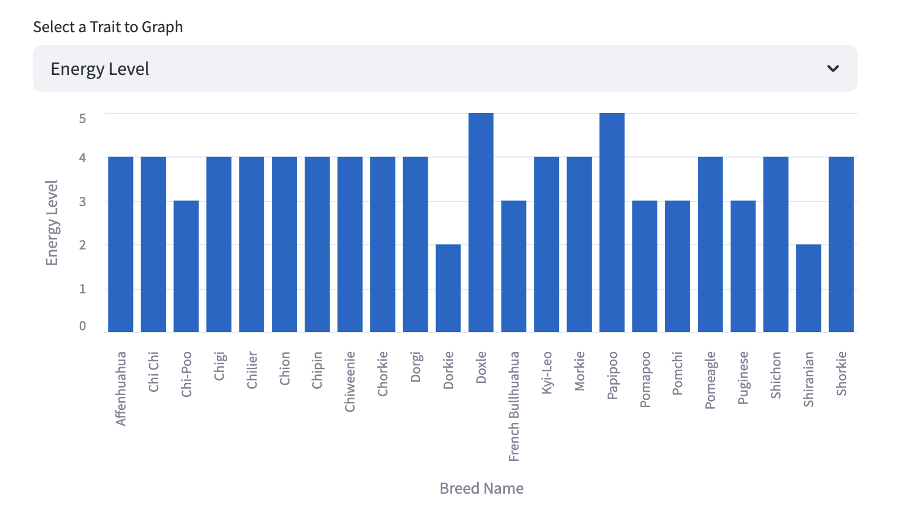

# :dog: DogFinder :poodle:
*An Interactive Explorer for Dog Breed Traits*

## Table of Contents
- [Project Overview](#project-overview)
- [Getting Started](#getting-started)
- [Dataset](#dataset)
- [App Features](#app-features)
- [Visualization](#visualization)
- [References](#references)

---

## Project Overview  
**DogFinder** is a lightweight, interactive **Streamlit** app designed to help users explore and compare dog breeds based on traits like friendliness, energy, and trainability.

Whether you're researching the best dog breed for apartment living or simply curious about canine characteristics, DogFinder provides intuitive filters and visualizations for hands-on exploration.

---

## Getting Started

### Deployed App
Access the live version here: [**Deployed App on Streamlit Cloud**](https://dogfinder.streamlit.app/)

### Run the App Locally

#### Clone & Navigate to the Repository
```bash
git clone https://github.com/annamccartan3/McCartan-Data-Science-Portfolio.git
cd McCartan-Data-Science-Portfolio/basic_streamlit_app
```

#### Install Dependencies  
All dependencies can be found in the requirements.txt file. Create and activate a virtual environment, then install the necessary libraries:
```bash
pip install -r requirements.txt
```

#### Run the Streamlit App
```bash
streamlit run main.py
```

---

## Dataset
DogFinder utilizes a cleaned dataset from [Kaggle](https://www.kaggle.com/datasets/yonkotoshiro/dogs-breeds), which contains information on nearly **400** dog breeds. Most traits are rated on a scale from 1 to 5. The dataset includes details such as:  

- **Breed Group:** Classification based on temperament, skills, and history  
- **Height:** Average height (cm)  
- **Weight:** Average weight (kg)  
- **Life Span:** Typical lifespan range  
- **Adaptability:** Suitability for novice owners, apartment living, and hot/cold weather  
- **Friendliness:** Affection toward family, kids, strangers, and other dogs  
- **Health & Grooming:** Shedding level, drooling tendencies, grooming requirements  
- **Trainability:** Intelligence, barking tendencies, energy level

---

## App Features
DogFinder allows you to:
- **Filter** by breed group, height, and weight
- **Visualize** differences in traits like friendliness and trainability
- **Display** filtered breed lists in a comparative table view

Simple dropdowns and sliders make it easy to explore subsets of the data.

---

## Visualization  
The app generates a dynamic bar chart to visualize the selected trait across matching breeds.<br>
**Example Chart**<br>


---

## References  

- [Dog Breeds dataset](https://www.kaggle.com/datasets/yonkotoshiro/dogs-breeds) – via Kaggle
- Developed with [Streamlit](https://streamlit.io/) and [Pandas](https://pandas.pydata.org/)

